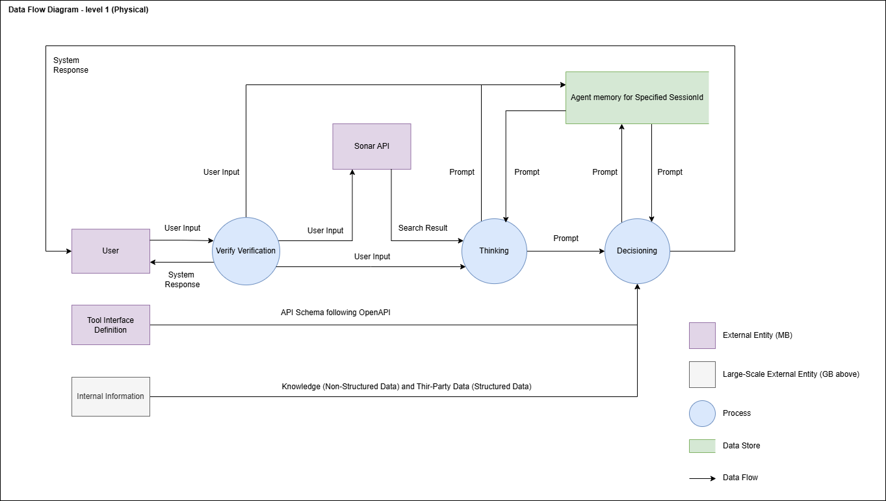
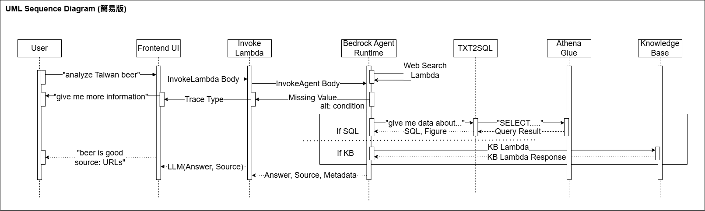

# Ai ChatBot Agent

## 簡介

本 Ai ChatBot Agent 是基於 Ai Agent 所建構的產品導向程式碼，包含 KnowledgeBase、Agent 以及其他 AWS Serverless GenAI 解決方案。此解決方案展示了一個能夠基於實際市場數據與最新資訊，產出高品質的產業分析相關報告之 ChatBot。該 ChatBot 能將自然語言轉換為 Amazon Athena 查詢，並處理與使用複雜資料集，並結合 Amazon Bedrock 及 Opensearch 的能力，達成高效的 Agent 事務。

此外，透過開源工具如 LLamaIndex 來加強資料處理與檢索能力。此解決方案整合了多個 AWS 資源，包括 Amazon S3（儲存）、Amazon Bedrock KnowledgeBase（支援 RAG）、Amazon Bedrock Agent（執行跨資料源的多步任務）、Amazon Simple Queue ServiceAmazon Simple Queue Service (同時共用記憶)、AWS Glue（資料準備）、Amazon Athena（執行查詢）、Amazon Lambda（管理容器）與 Amazon ECS（容器部署），讓 ChatBot 能有效率地從資料庫與文件中檢索與管理內容，展示 Amazon Bedrock 在開發進階 ChatBot 應用上的強大能力。

## 💡 Wireframe

- 此為本專案[大致的方向](https://www.figma.com/board/MLLm8M07DzgcWCwf4hqd1F/%E6%95%B8%E6%93%9AAI-Agent%E8%A6%8F%E5%8A%83?node-id=0-1)。

- 此為本專案[UI 設計概念](https://www.figma.com/design/EEDUf7j1m5zoaHguuEgmZO/Untitled?node-id=0-1&p=f)。


## 先決條件

- 已安裝 Docker
- 已安裝並設定 AWS CDK Toolkit 版本 2.114.1 以上。如需詳細資訊，請參閱 AWS CDK 文件的「[Getting started](https://docs.aws.amazon.com/cdk/v2/guide/getting_started.html)」
- 已安裝並設定 Python 3.11 以上版本。詳見 Python 文件中的「[Beginner’s Guide/Download](https://wiki.python.org/moin/BeginnersGuide)」。
- 一個有效的 AWS 帳戶
- 在 `us-east-1` 使用 AWS CDK 完成 bootstrapping 的 AWS 帳戶，並已啟用 Claude 模型與 Titan Embedding 模型的使用權限（於 Bedrock 服務中）。


## 目標技術堆疊

- Amazon Bedrock
- Amazon OpenSearch Serverless
- Amazon ECS
- Amazon Simple Queue Service
- AWS Glue
- AWS Lambda
- Amazon S3
- Amazon Athena
- Elastic Load Balancer


## 雲端架構圖

底下是基於技術堆疊繪製的雲端架構圖，主要展示各服務彼此間在此專案之關係：


## 物理資料流程圖

底下是物理資料流程圖，主要展示各資料間的來源、處理及儲存資訊：



## 時序圖

底下是時序圖，主要展示各角色間傳遞資料的順序，加速對程式維護與開發:




## 部署

若要在本地端執行此應用，請先在 code/streamlit-app 資料夾中新增 .env 檔案，內容如下：
```.env
ACCOUNT_ID = <您的帳戶 ID>
AWS_REGION = <您所屬區域>
LAMBDA_FUNCTION_NAME = invokeAgentLambda # 設定 Streamlit 呼叫的 Lambda 函數名稱，目前呼叫 Agent。
```
`cdk.json` 檔案告訴 CDK 工具如何執行此應用程式。

本專案為標準 Python 專案結構，初始化過程會建立虛擬環境 `.venv`。若自動建立失敗，可手動執行下列指令建立：

### MacOS/Linux：
```bash
$ python3 -m venv .venv
```

啟用虛擬環境：
```bash
$ source .venv/bin/activate
```


### Windows：
```powershell
% .venv\Scripts\activate.bat
```

啟動後，安裝依賴套件：
```bash
$ pip install -r requirements.txt
```
若需額外依賴（例如其他 CDK 套件），請將其加入 setup.py，再重新執行上述安裝指令。

接著產生 CloudFormation 模板：
```bash
$ cdk synth
```

首次使用 CDK 部署到帳戶/區域時，需先執行 bootstrapping：
```bash
$ cdk bootstrap
```

然後就可以進行部署：
```bash
$ cdk deploy
```

> 首次部署時，ECS 會建構數個 Docker 映像，約需 30～45 分鐘。完成後會部署 chatbot-stack，大約 5～8 分鐘完成。

部署完成後，終端機會顯示 CDK 輸出結果，也可至 CloudFormation 主控台查看狀態。

您可透過 AWS 主控台測試 Agent，或使用 chatbot-stack 輸出的 Streamlit 網址測試。

如不再使用，為避免產生額外費用，可執行以下指令移除資源：
```bash
$ cdk destroy
```


## 常用 CDK 指令
- `cdk ls`：列出所有 stack
- `cdk synth`：產生 CloudFormation 模板
- `cdk deploy`：部署目前 stack 至預設 AWS 帳號/區域
- `cdk diff`：比較目前與已部署版本的差異
- `cdk docs`：開啟 CDK 官方文件
- `cdk destroy`：銷毀指定 stack


## 高階程式碼結構

```bash
code                              # 專案主程式碼目錄
├── lambdas                           # 所有 Lambda 函數
│   ├── action-lambda                     # 由 Bedrock Agent 呼叫的 action lambda
│   ├── create-index-lambda               # 建立 OpenSearch Serverless 索引（供 KnowledgeBase 使用）
│   ├── invoke-lambda                     # Streamlit 呼叫的 Lambda（觸發 Bedrock Agent）
│   └── update-lambda                     # 在 CDK 部署資源後進行更新/刪除
├── layers                            # 所有 Lambda layer
│   ├── boto3_layer                       # 通用 boto3 layer
│   └── opensearch_layer                  # 建立 OpenSearch 索引所需的套件
├── streamlit-app                         # Streamlit 前端，與 Bedrock Agent 互動
└── code_stack.py                     # 使用 CDK 建立所有 AWS 資源
```


## 使用特定資料

若要以自有資料部署此 ChatBot，請依下列指引進行整合與調整：

### 一、整合 KnowledgeBase 資料

1. 資料準備：
將您的資料集放入 `assets/knowledgebase_data_source/` 資料夾。

2. 設定調整：
    開啟 `cdk.json`，修改 `context/configure/paths/knowledgebase_file_name` 欄位為您的檔案名稱。

    修改 `bedrock_instructions/knowledgebase_instruction`，以符合新資料集的內容語意。


### 二、整合結構化資料（如表格）

1. 資料準備：
    在 `assets/data_query_data_source/` 建立資料子資料夾（例如 `tabular_data`）。

    將您的結構化資料（CSV、JSON、ORC 或 Parquet 格式）放入該資料夾。

    若使用您自有資料庫，請修改 `code/lambda/action-lambda/build_query_engine.py` 中的 `create_sql_engine()` 函式，改為連接您資料庫。

2. 設定與程式碼更新：
    修改 `cdk.json` 中 `context/configure/paths/athena_table_data_prefix` 對應您的新資料路徑。
    
    更新 `code/lambda/action-lambda/dynamic_examples.csv`，新增對應您資料集的文字轉 SQL 範例。
    
    調整 `prompt_templates.py`，使 prompt 符合您的表格資料欄位。
    
    修改 `cdk.json` 中 `context/configure/bedrock_instructions/action_group_description`，說明新的 action lambda 功能。
    
    更新 `assets/agent_api_schema/artifacts_schema.json`，反映新功能的 schema。


### 三、一般設定更新
請更新 `cdk.json` 中 `context/configure/bedrock_instructions/agent_instruction`，清楚說明此 Agent 的任務與目的，反映整合後的新資料。